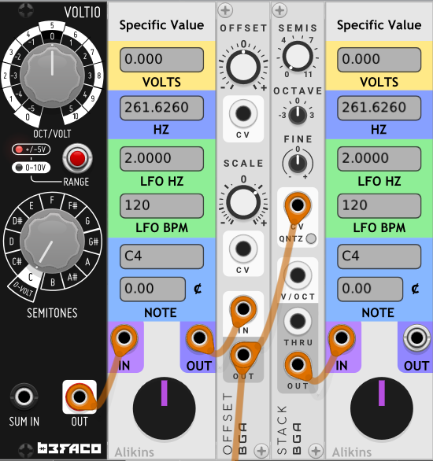
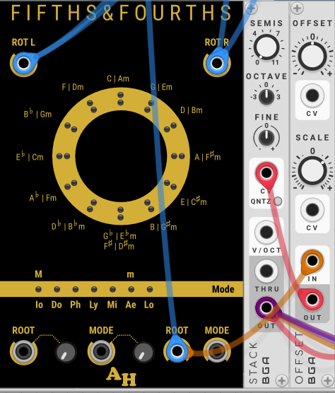
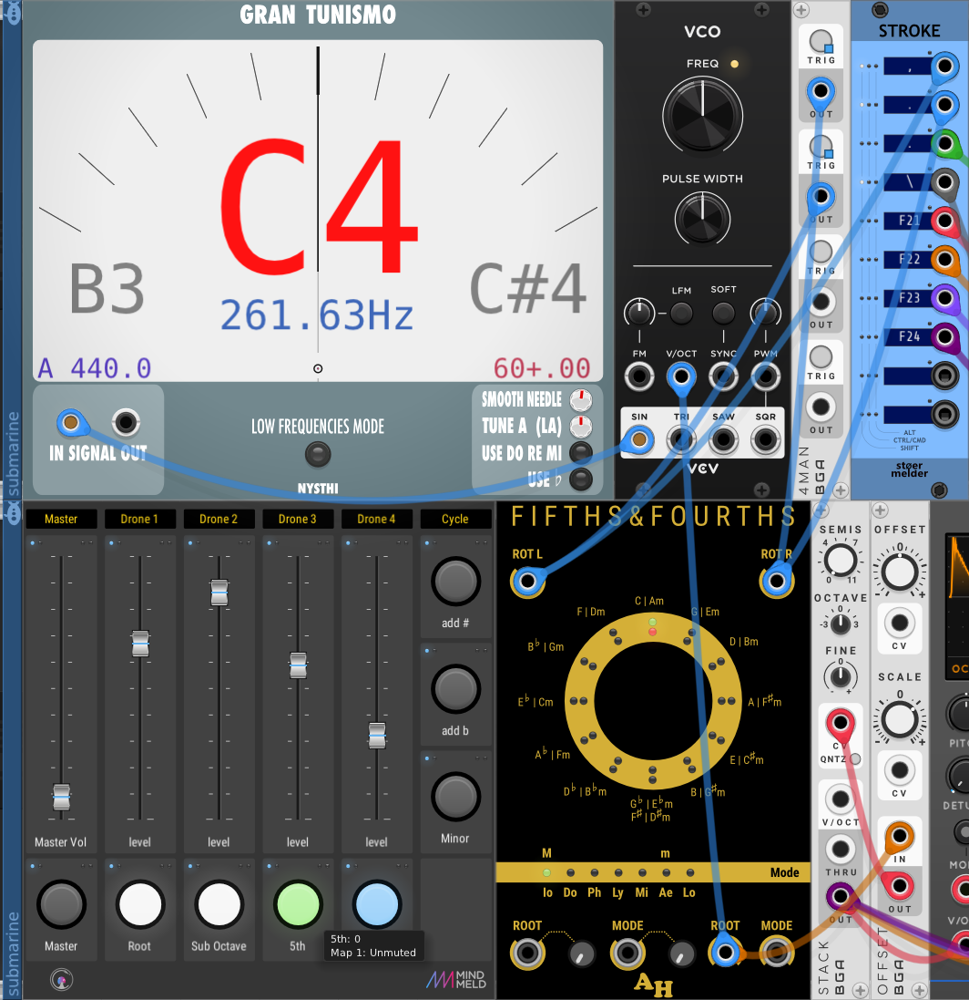

#+TITLE: vcv transpose
# Tags #music #vcv
* Transposing a whole patch
:PROPERTIES:
:ATTACH_DIR: /home/iain/Documents/org-mode/NotationalVelocity/2512211253 vcv transpose-images
:END:
I like the *Befaco* *Voltio* as a master pitch changer because of the large knob with the note names around it. However the range doesn't suit the *Bogaudio* *Stack* which seems to be the obvious choice for a transposer. Feeding it through a *Bogaudio* *Offset* first with the scale set to =1.2= fixes that, and everything transposes correctly:
[[file:VCV-Patches/Transpose.vcv][patch]]

The *Amalgamated Harmonics* module, *Fifths & Fourths* can also be used to change keys around the cycle of fifths at the press of a button.

[[file:VCV-Patches/Drone-Cycle.vcv][patch]]
It's not very obvious which key is selected so I used another oscillator just to drive a pitch meter so its clear even from across the room.

